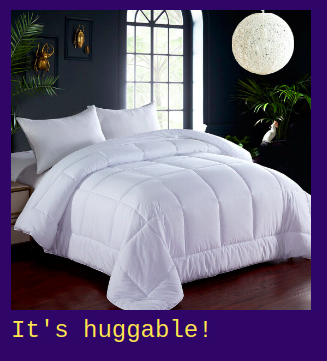
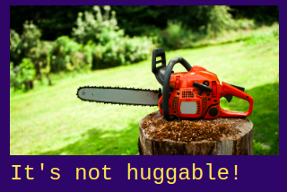
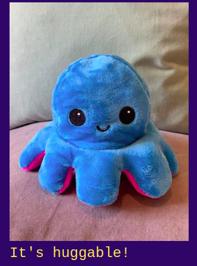
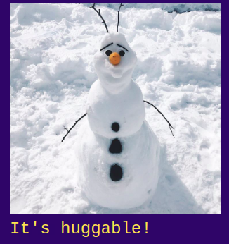
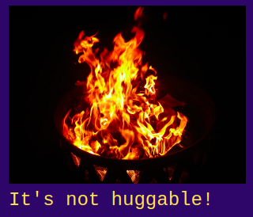
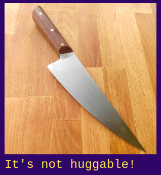
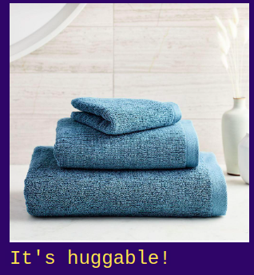

# Is it Huggable?
An image classifier that tells if something's huggable or not?

Play with it on the [website](https://daspartho.github.io/is-it-huggable/) or on [HuggingFace Space](https://huggingface.co/spaces/daspartho/is-it-huggable).

# How it works?
A pretrained image classification model (here resnet34) is fine tuned on images of multiple examples of both categories, like for huggable, pillow photos and for not huggable, images of cactus.

For steps to make the model check the [model](https://github.com/daspartho/is-it-huggable/blob/main/model.ipynb) notebook in the repo.

# Examples

# Contributing
If you want to contribute code, just write a quick pull request and the developers will take a look at it. If you want to suggest an idea, just write an issue and the developers will check it out!